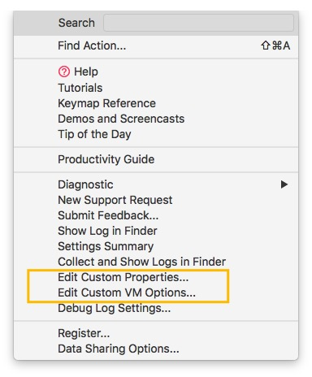

# 相关核心文件和目录介绍

## 安装目录介绍

> * `.vmoptions` 文件是 可执行文件的 VM 配置文件。
> * `idea.properties` 文件是 一些属性配置文件。

- **强烈推荐不要直接修改安装目录下的这几个配置文件，因为 升级/重装可能会导致修改完全失效！**

- **强烈推荐使用自带菜单中的 `Help -> Edit Custom VM Options` 和 `Help -> Edit Custom Properties` 来进行参数个性化配置！**

  

## 配置文件常见修改内容说明

> `.vmoptions` 文件修改
>
> > *  `-Xms128m`，16 G 内存的机器可尝试设置为  `-Xms512m`
> > * `-Xmx750m`，16 G 内存的机器可尝试设置为 `-Xmx1500m`
> > * `-XX:ReservedCodeCacheSize=225m`，16G 内存的机器可尝试设置为  `-XX:ReservedCodeCacheSize=500m`

> `.idea.properties` 文件修改
>
> > *  `idea.max.intellisense.filesize=2500`，该属性主要用于提高在编辑大文件时候的代码帮助。在编辑大文件的时候还是很容易卡顿的。
> > * `idea.cycle.buffer.size=1024`，该属性主要用于控制控制台输出缓存。有遇到一些项目开启很多输出，控制台很快就被刷满了没办法再自动输出后面内容，这种项目建议增大该值或是直接禁用掉，禁用语句 `idea.cycle.buffer.size=disabled`。

## 设置目录进行多台设置同步化处理

> * 设置方式很简单，修改 idea.properties 属性文件中的 idea.config.path 值，windows为：`idea.config.path=F:/360SycDir/idea_config/config`  Mac OS的为`idea.config.path=/Users/xxxx/Library/Preferences/PhpstormXX`
> * `idea.system.path=xxx`
> * `idea.plugins.pat=xxx`

## 不同平台下文件配置说明

####  Windows
> * `<User home>.WebIdeXX/config` 存放用户指定的设置。
> *  `<User home>.WebIdeXX/system` 存放PHPStorm 缓存文件。
> *  `<User home>` 在 WindowsXP 是指 `C:Documents and Settings <User name>`; 在Windows 7 以上是指 `C:Users <User name>`

#### Linux
> * `~/.WebIdeXX/config` 存放用户指定的设置。
> * `~/.WebIdeXX/system` 存放PHPStorm 缓存文件。

#### Mac OS
> * `~/Library/Application Support/WebIdeXX` 存放PHPStorm插件。
> * `~/Library/Preferences/WebIdeXX` 存放PHPStorm配置文件。
> * `~/Library/Caches/WebIdeXX` 存放PHPStorm缓存，历史记录等。
> * `~/Library/Logs/WebIdeXX` 存放PHPStorm日志。

## 配置文件夹下的子文件夹的意义。

| 目录名称 |用户配置 |
| ---- | ---- | ---- |
|codestyles| 代码风格配置 |
|colors |编辑器颜色，字体等自定义方案的配置 |
|filetypes|用户自定义的文件类型配置 |
|inspection|代码检查配置 |
|keymaps|PhpStorm自定义快捷键的配置 |
|options|各个参数的配置，例如：功能使用情况统计 |
|templates|用户自定义的代码模版 |
|tools|外部工具的配置 |
|shelf|shelved配置 |

