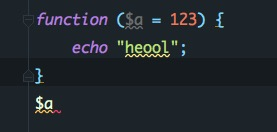
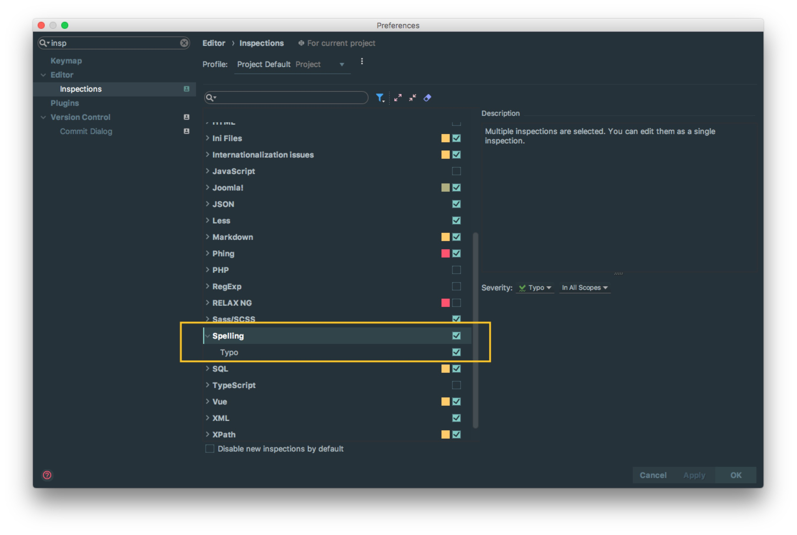
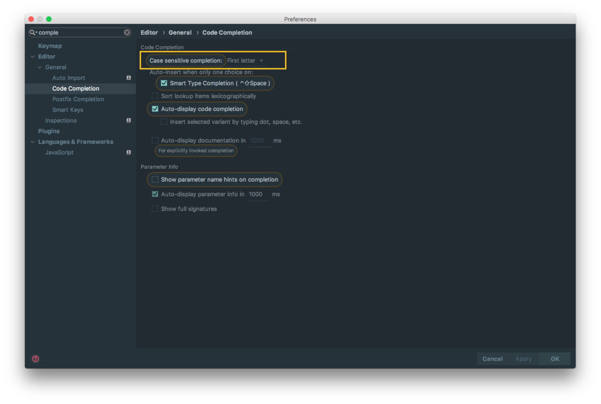
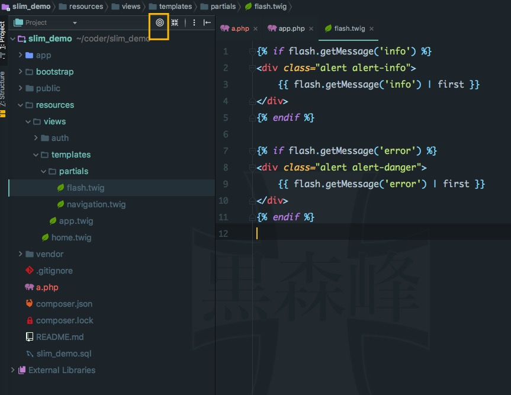
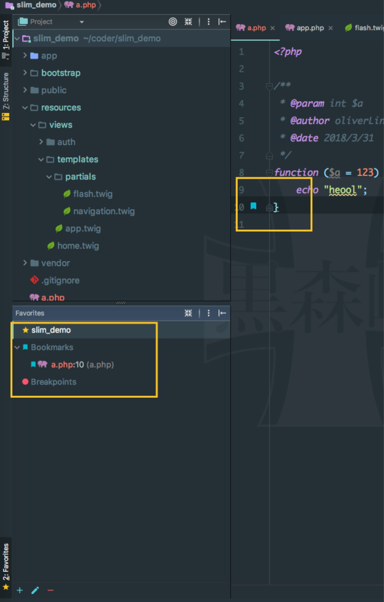
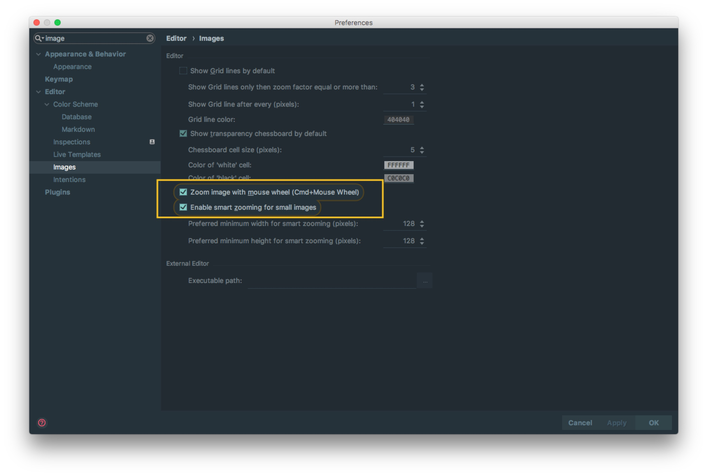

# 常用细节

## 设置代码检查等级

> * 上图中会有常见的几种波浪线， 红色的波浪线为错误。如果含有则此程序含有语法上的错误。黄色为拼写不规范。灰色为未用到的变量。 为保证代码优雅，建议不要出现上图中的任何波浪线。

> * 如上所示，默认是开启单词拼写检查的，有些人可能有强迫症不喜欢看到单词下面有波浪线，就可以去掉该勾选。但是我个人建议这个还是不要关闭，因为拼写检查是一个很好的功能，当大家的命名都是标准话的时候，这可以在不时方便地帮我们找到代码因为拼写错误引起的 Bug。

> * 上图中点击头像图标，会出现检测等级。从上而下意思为严格检查，一般检查和不检测
> * Power save mode 叫做 省电模式 的状态，开启这种模式之后会关掉代码检查和代码提示等功能。所以一般认为这是一种 阅读模式，如果你在开发过程中遇到突然代码文件不能进行检查和提示可以来看看这里是否有开启该功能。
> * Configure inspections

## 代码提示

> * 代码提示和补充功能有一个特性：区分大小写。如上图所示，默认就是 `First letter` 区分大小写的。
> * 区分大小写的情况是这样的：比如我们在代码文件中输入 `ECHO` 是不会帮我们提示或是代码补充的，但是如果我们输入 `echo` 就可以进行代码提示和补充。
> * 如果想不区分大小写的话，改为 `None` 选项即可。

## 自动导入

> * php的自动导入不是很多，如图所示，当需要时会自动导入`namespace`

## 代码折叠

> * 如上图标注所示，我们可以对指定代码类型进行默认折叠或是展开的设置，勾选上的表示该类型的代码在文件被打开的时候默认是被折叠的，去掉勾选则反之。

## 分割代码

> * 一般在对大文件进行修改的时候，有些修改内容在文件上面，有些内容在文件下面，如果来回操作可能效率会很低，用此方法就可以好很多。

## 常用的快捷键
撤销 ： `command + Z`
反撤销： `command + shift + Z`
复制上一行 :`command + D`
剪切当前行: `command + X`
上下行交换: `command+shift+↑↓`
当前选中行注释: `command + /`
多行注释： `command + shift + /`
搜索当前文件 ：`command + F`
替换当前文件：`command + R`
搜索项目：`command + shift + F`
替换项目：`command + shift + R`
选中多个当前的单词 ：`ctrl + G`

## PHPDOC 自动生成

> * 如图所示，phpdoc的自动生成

## 快速找到当前文件

> * 如图所示，可以快速找到当前文件

## 添加书签，方便查找代码

> * 快捷键F3，添加书签，再按下取消书签， 按Alt + F3 可以给书签做标记，有兴趣的可以试一下

## 滚轮控制字体大小

## 滚轮控制图片大小

## 展示行数和方法线

> * 如上图红圈所示，默认是没有勾选 `Show line numbers` 显示行数的，但是我建议一般这个要勾选上。
> * 如上图红圈所示，默认是没有勾选 `Show method separators` 显示方法线的，这种线有助于我们区分开方法，所以也是建议勾选上的。

## 折叠代码

> * 使用快捷键 command + alt +T 生成折叠评论代码

## 浏览即打开，跳转到文件来源

> * 上图配置为浏览即打开

> * 上图配置为跳转到文件来源

## tab 按钮

> * 如上图所示，在打开很多文件的时候，默认是把所有打开的文件名 Tab 单行显示的。个人现在的习惯是使用多行，多行效率比单行高，因为单行会隐藏超过界面部分 Tab，这样找文件不方便。`Tab Limit` 表示最多展示tab的数量, 后面的单选的意思是:勾选上之后跳转新方法时，不是新开tab,而是在当前tab下打开

